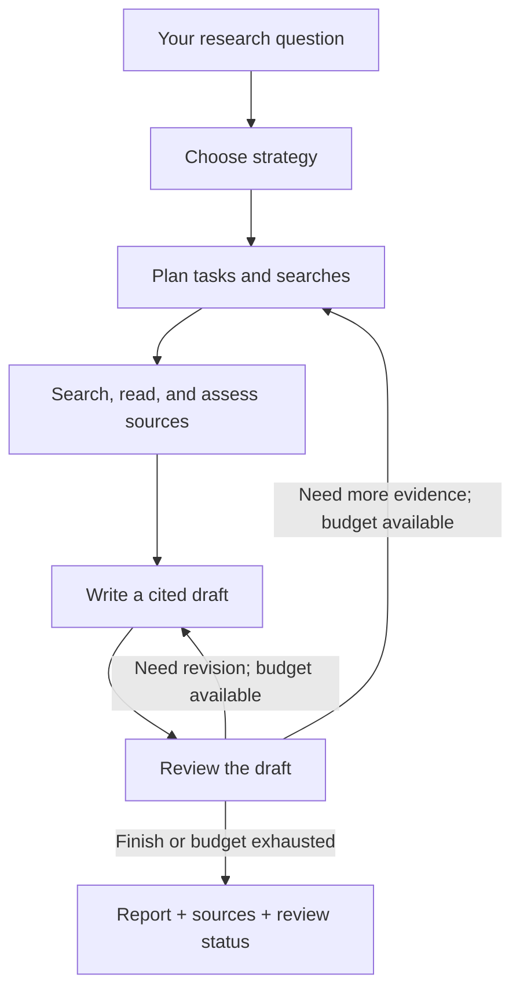
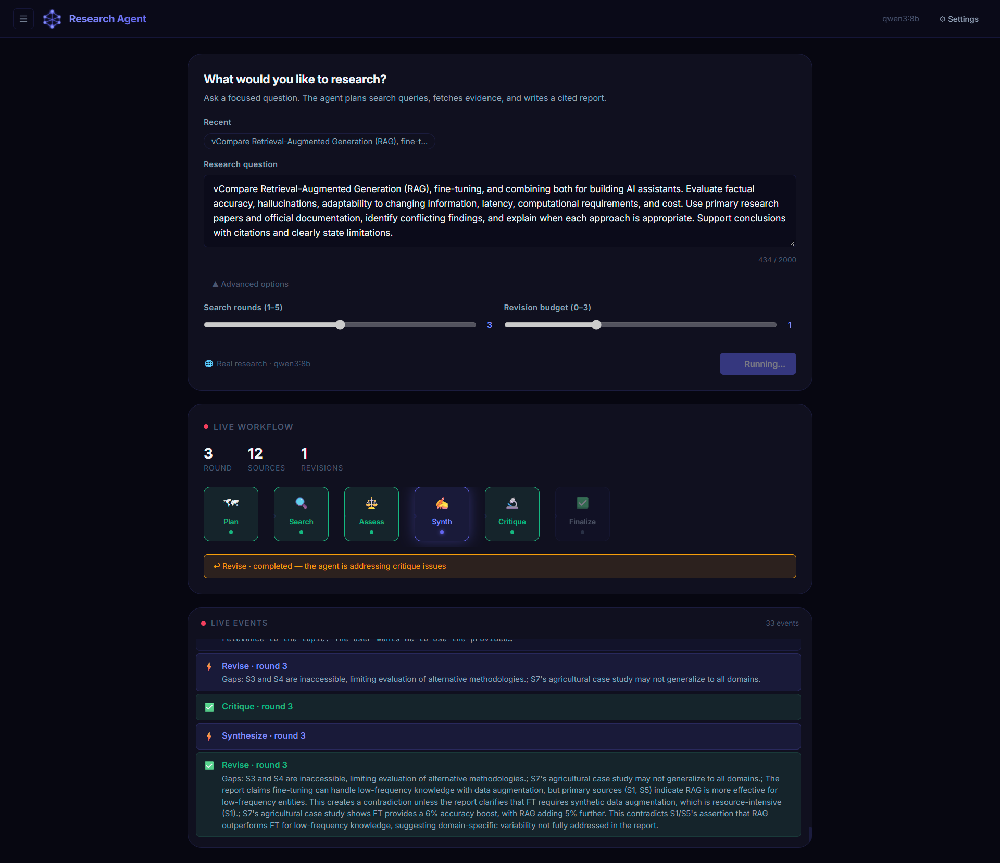
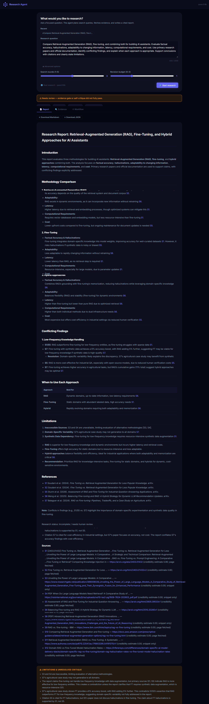

# Research Agent — LangGraph + Ollama

An AI research assistant that runs its language model on your computer. Ask a question, watch it search the web and review the evidence, then download a report with source citations.

Built with **Python, LangGraph, Ollama, FastAPI, and React**. The default model is **qwen3:8b**. No paid language-model or search API key is required.

## The idea, explained simply

Think of the system as a researcher with a checklist:

1. **Understand the question.** Choose a research strategy and scope.
2. **Make a plan.** Break the question into smaller tasks and web searches.
3. **Gather evidence.** Search with DDGS, read accessible HTML pages, remove duplicate URLs, and estimate source relevance and credibility.
4. **Write a draft.** Combine the evidence into a Markdown report with citations such as `[S1]`.
5. **Review the draft.** Look for unsupported claims, contradictions, missing perspectives, and citation problems.
6. **Improve or finish.** Search again or revise within the configured budgets, then return the report and any unresolved issues.

LangGraph connects these steps and keeps track of the question, sources, draft, and review feedback. Ollama runs the model used for planning, assessment, writing, and review. These are roles in one workflow using the configured model.



## Screenshots

### Live research workflow

Watch the current stage, search-round count, source count, revisions, and event log as the agent works.



### Report with citations and review feedback

The example compares RAG, fine-tuning, and hybrid approaches. It shows a cited report, source links, limitations, and a **Needs review** status. The screenshot is an example of the interface; the report still requires human review.

<details>
<summary>Open the full report screenshot</summary>


</details>

<details>
<summary>Open the second supplied report screenshot</summary>

The first two supplied screenshots are identical. Both originals are included here.



</details>

## What you can do

- Ask a research question of up to 2,000 characters.
- Set search rounds (1–5) and the revision budget (0–3) in the UI.
- Follow live stage updates through Server-Sent Events.
- Inspect evidence, source credibility estimates, and review feedback.
- Reopen previous jobs stored in a local SQLite database.
- Download the final report as Markdown and the research data as JSON.
- Run research from the browser or command line.
- Try an offline demo with clearly labeled synthetic evidence.

## Run it locally

You need **Python 3.11+** (tested with 3.12), **Node.js and npm** for the frontend, **Git**, and [Ollama](https://ollama.com). Installation and real web research require internet access. Model speed depends on your available RAM, GPU, model size, and context length.

### 1. Download the code and model

```bash
git clone https://github.com/georgeemiL787/research-agent-langgraph.git
cd research-agent-langgraph
ollama pull qwen3:8b
```

Make sure Ollama is running. If the desktop app already serves `localhost:11434`, use that instance. Otherwise start it in a separate terminal with `ollama serve`.

### 2. Set up the Python backend

**Windows PowerShell:**

```powershell
py -3 -m venv .venv
.\.venv\Scripts\python.exe -m pip install -e ".[api]"
Copy-Item .env.example .env
.\.venv\Scripts\python.exe -m research_agent.cli --doctor
.\.venv\Scripts\python.exe -m uvicorn api.main:app --host 127.0.0.1 --port 8000
```

**Linux / macOS:**

```bash
python3 -m venv .venv
source .venv/bin/activate
python -m pip install -e ".[api]"
cp .env.example .env
python -m research_agent.cli --doctor
python -m uvicorn api.main:app --host 127.0.0.1 --port 8000
```

Keep this terminal running. If you already have a configured `.env`, keep it instead of copying over it.

### 3. Start the frontend

Open another terminal in the repository:

```bash
cd frontend
npm ci
npm run dev
```

Open [http://localhost:3000](http://localhost:3000), enter your question, and select **Start research**. The frontend forwards API requests to port 8000. API documentation is available at [http://localhost:8000/docs](http://localhost:8000/docs).

For a single-server setup, run `npm run build` inside `frontend/`, then start or restart the backend and open [http://localhost:8000](http://localhost:8000). FastAPI serves the built frontend when `frontend/dist/` exists.

## Command-line examples

Run these with your virtual environment activated, or use `.\.venv\Scripts\python.exe` in place of `python` on Windows.

```bash
python -m research_agent.cli --doctor
python -m research_agent.cli "Compare LoRA and full fine-tuning using primary sources"
python -m research_agent.cli --demo "Demonstrate the research workflow"
```

The demo uses fixtures and does not require Ollama or live web access. It demonstrates the workflow, not factual research.

## Settings

Copy `.env.example` to `.env` and adjust the values before starting the backend.

| Setting | Default | Meaning |
| --- | --- | --- |
| `OLLAMA_BASE_URL` | `http://localhost:11434` | Address of your Ollama server |
| `OLLAMA_MODEL` | `qwen3:8b` | Installed model used by the workflow |
| `OLLAMA_TIMEOUT` | `180` | Timeout for each model request, in seconds |
| `NUM_CTX` | `16384` | Model context-window setting |
| `MAX_SEARCH_ROUNDS` | `3` | Maximum rounds of web searching |
| `MAX_REVISIONS` | `1` | Maximum draft revisions |
| `RESULTS_PER_QUERY` | `3` | Search results requested per query |
| `MAX_SOURCES` | `12` | Source budget |
| `MIN_CREDIBLE_SOURCES` | `2` | Minimum assessed, relevant, fetched sources for the evidence check |
| `OUTPUT_DIR` | `outputs` | Folder for saved reports and research data |

Use an installed Ollama model that supports JSON-schema structured output. A smaller model, fewer search rounds, or a smaller context window can reduce resource use. Increase the timeout if local inference takes too long.

## Results and limits

Each run saves `outputs/<run-id>/report.md` and `research.json`. The JSON contains the sources, assessments, queries, critique, execution trace, and errors. Browser job history is saved in `research.db`.

A **Needs review** result means the workflow did not finish with a passing review before its budgets ran out. A passing model review is also not a factual guarantee. Credibility scores are model estimates, and citations still need checking against the original sources.

The fetcher reads HTML only. It does not parse PDFs or render JavaScript pages; blocked websites and paywalls can reduce available evidence. Search services can also fail or rate-limit requests. Citation checks reject unknown source IDs and raw URLs in drafts, but do not prove that every cited claim is correct.

Model inference runs locally. Web search queries and requests to public pages leave your computer. The app is intended for use in a trusted local environment. The workflow uses direct web search and page text; it has no vector database or embedding-based retrieval.

## Project layout

```text
research_agent/       LangGraph workflow, Ollama client, search, and CLI
api/                  FastAPI routes, background worker, and SQLite job history
frontend/             React + Vite interface
docs/                 Architecture notes and screenshots
examples/             Sample offline demo report
.env.example          Configuration template
LICENSE               MIT license
```

See [the architecture notes](docs/ARCHITECTURE.md) for implementation details and [validation notes](VALIDATION.md) for historical checks. `requirements-lock.txt` preserves a prior environment snapshot; the setup above installs the declared project dependencies and API extras from `pyproject.toml`.

## Troubleshooting

| Problem | Try this |
| --- | --- |
| Cannot connect to Ollama | Start Ollama and check `OLLAMA_BASE_URL`; run `--doctor` |
| Model is missing | Run `ollama pull qwen3:8b`, or select another installed model |
| Research is slow | Try a smaller model, fewer rounds, or lower `NUM_CTX` |
| Report needs review | Inspect the critique, narrow the question, or increase the available budgets |
| No readable evidence | Try a focused question whose sources are accessible HTML pages |
| Backend cannot import a dependency | Install `python -m pip install -e ".[api]"` in the active virtual environment |

## License

The project code is available under the [MIT License](LICENSE), copyright © 2026 George Emil. Third-party libraries, Ollama models, and source material retain their own licenses and terms; the project license does not relicense them.
