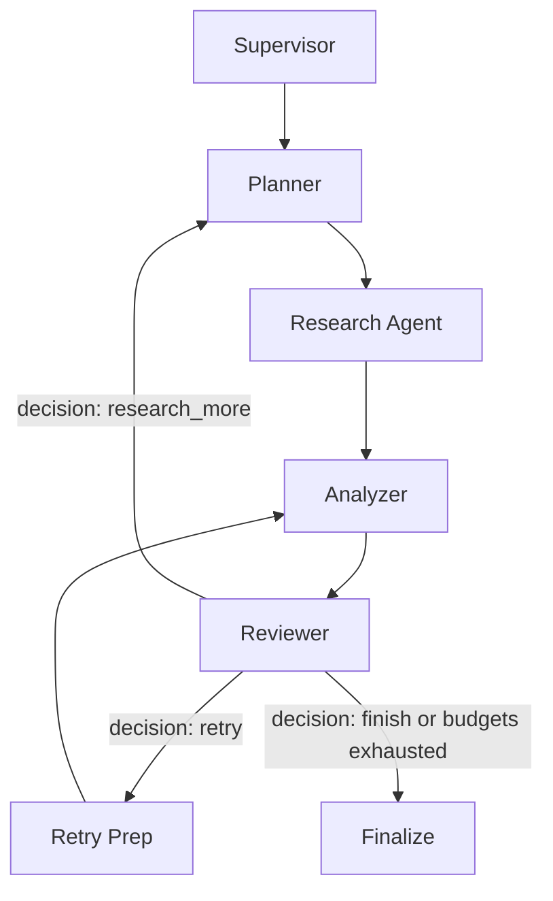

# Architecture
One LangGraph StateGraph owns the workflow. Each node returns a partial typed state representing the working memory. **No RAG, embeddings, or vector databases are used.** The web is queried directly, and pages are fetched as text and treated strictly as untrusted evidence.

## Core Components
- **Supervisor**: Chooses the research strategy based on the question (factual lookup, comparison, or in-depth research) and defines scope and stop conditions.
- **Planner**: Breaks the question into tasks and formulates search queries.
- **Research Agent**: Executes search queries using DDGS and HTTP fetching. It deduplicates URLs, assesses relevance and credibility, and strictly bounds evidence to context limits. Sources with a credibility score below 0.20 or a fetch failure are discarded and logged, preventing them from being re-fetched and freeing up budget.
- **Memory**: The LangGraph state maintains tasks, queries, sources, gaps, review reasons, and budgets.
- **Analyzer**: Synthesizes the draft report citing actual source IDs `[S1]`.
- **Reviewer**: Evaluates the report for unsupported claims, contradictions, and completeness, then returns a structured decision (`retry`, `research_more`, or `finish`).

## Execution Boundaries
Source IDs are assigned deterministically by code. Credibility is an LLM estimate, not a verified fact. The workflow limits search rounds and revisions. If search or revision budgets are exhausted, the loop is forcibly terminated and the final report is marked as `needs_review`. The draft is withheld entirely if the model hallucinates citation IDs or invents arbitrary URLs in the text.

## Limitations
Page fetching supports HTML only; PDFs, JS-heavy sites, paywalls, and blocked websites remain limitations. No code execution or browser automation tools are exposed to the model. Public-address checks block ordinary private-network requests and validate redirects; DNS rebinding remains a limitation of hostname-based validation. Run in a trusted local environment.
